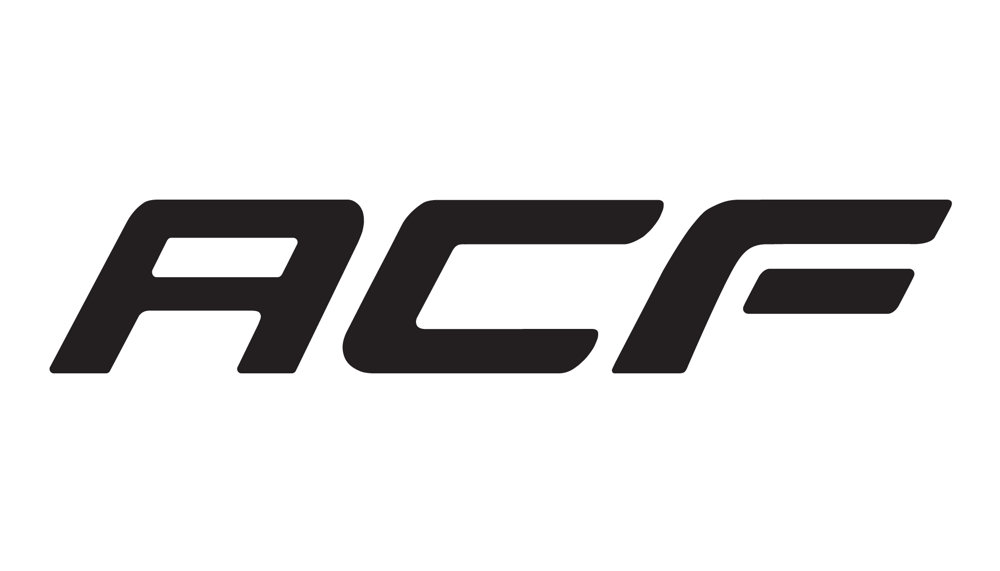

# Armored Combat Framework
> A standardized combat and damage addon for Garry's Mod

Armored Combat Framework (ACF) is an addon for Garry's Mod that implements a damage system for props and players, while also providing entities and tools to build fairly realistic armored combat vehicles. Players may choose from an array of guns, ammo types, crates for fuel and ammo, engines, transmissions and more while armoring their contraptions for combat.

Ammunition is customizable with varying ballistic performance along with armor being customizable for protection against various threats. ACF is intended to be balanced for multiplayer and competitive use but there is, of course, nothing wrong with blasting some NPCs.

## Installation

### Dependencies
> ACF requires these additional addons in order to function properly

Prop Protection with [CPPI](http://ulyssesmod.net/archive/CPPI_v1-3.pdf) is not required, but highly recommended. We'd recommend Nadmod PP ([Workshop](https://steamcommunity.com/sharedfiles/filedetails/?id=159298542) or [Github](https://github.com/Nebual/NadmodPP)).

Wiremod ([Workshop](https://steamcommunity.com/workshop/filedetails/?id=160250458) or [Github](https://github.com/wiremod))
### Git Client (Recommended)

Install a Git client, such as the [Github client](https://desktop.github.com/) or [GitKraken](https://www.gitkraken.com/), then clone ACF to your addons folder. With the Github client installed you can click the green button at the top of the ACF repo page and select clone. Updating ACF on your server or client after install simply requires clicking the pull button in your respective Git client.

### Manually

Click the green button at the top of the ACF repo and select zip. Extract and move to your addons folder.

## Contributing

Found an annoying bug in the addon? Want to suggest a brand new feature? Think something should be changed? Make sure to check out [Contributing to ACF](CONTRIBUTING.md), where we have a full guide on how to properly contribute to this project.
